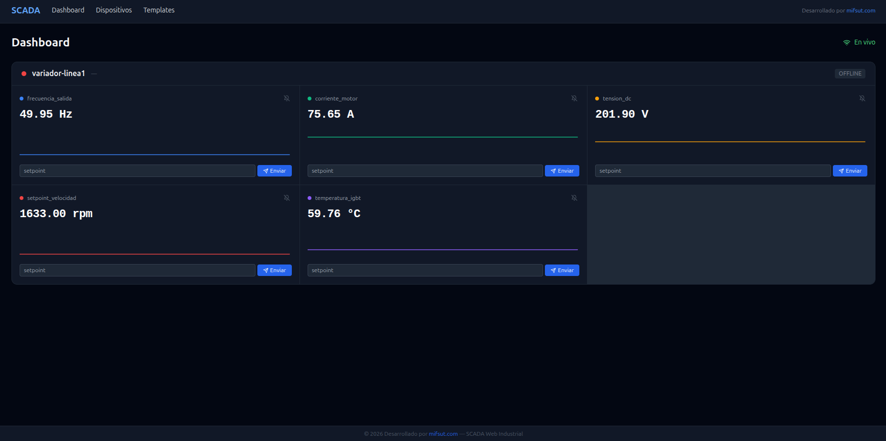
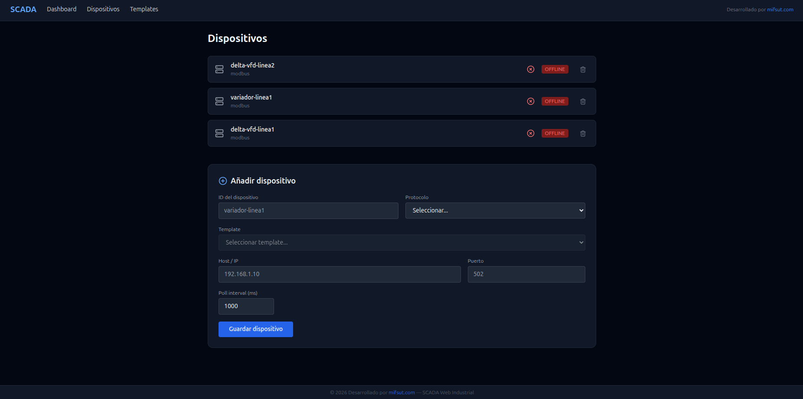
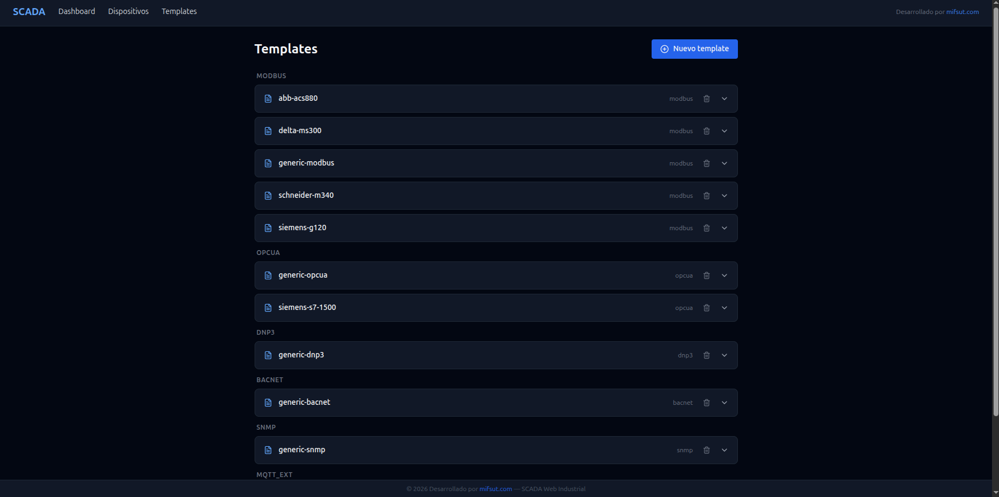
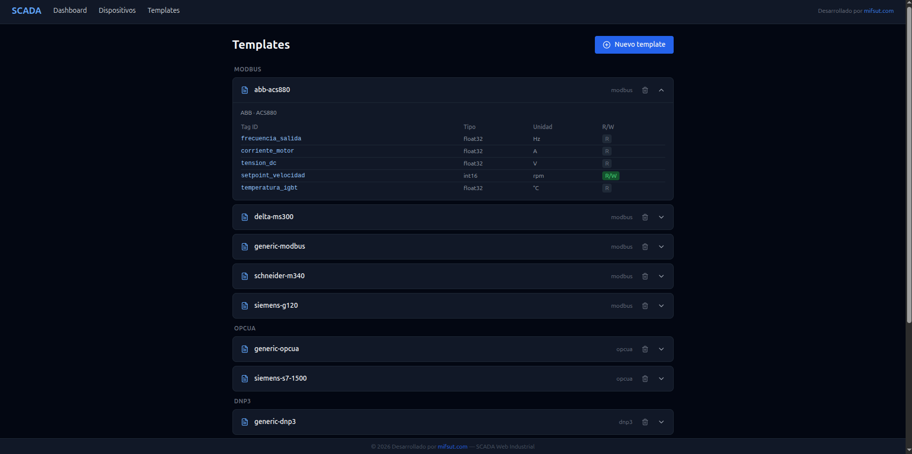
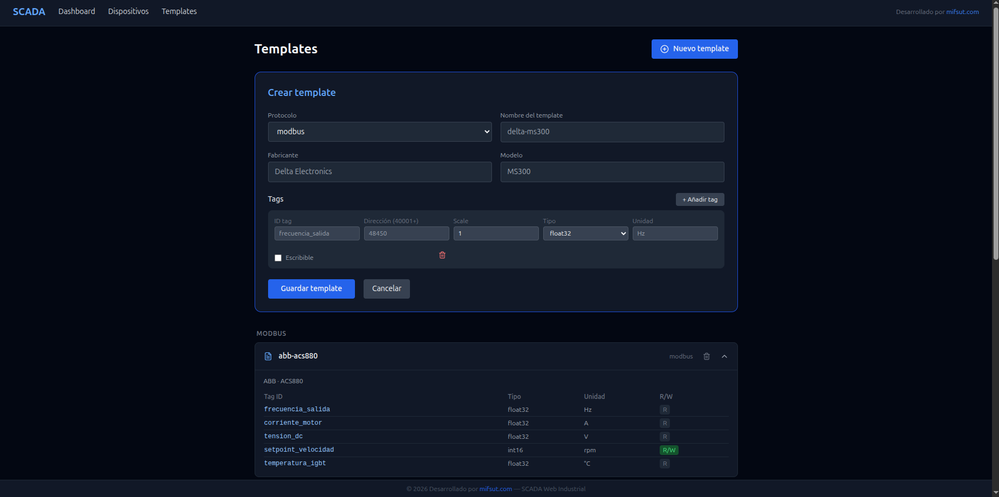

# SCADA Web Industrial — mifsut.com

Sistema SCADA web moderno, self-hosted y portable entre proyectos. Desplegable con un solo comando. Soporta Modbus TCP, OPC-UA, EtherNet/IP, BACnet, DNP3, SNMP y MQTT.


---

## Instalación en un comando

```bash
bash <(curl -fsSL https://raw.githubusercontent.com/joseluisnebot/mifsut-scada/main/start.sh)
```

Instala Docker, clona el repositorio, configura el entorno y arranca todo automáticamente.

Cuando termine, abre el navegador en:
```
http://localhost:3000
```

> El sistema arranca en **modo simulador** — genera datos realistas sin necesitar hardware. Para conectar dispositivos reales consulta la sección [Producción](#pasar-a-producción).

---

## Capturas de pantalla

### Dashboard — datos en tiempo real con gráficas y alarmas



### Gestión de dispositivos


### Templates por protocolo


### Detalle de un template con sus tags


### Crear un template nuevo desde la web


---

## Qué incluye

| Componente | Tecnología | Puerto |
|---|---|---|
| Dashboard web | Next.js 14 + Tailwind + Recharts | 3000 |
| API REST + WebSocket | FastAPI (Python) | 8000 |
| Bus de mensajes | MQTT (Mosquitto) | 1883 |
| Histórico de datos | InfluxDB 2 | 8086 |
| Base de datos config | PostgreSQL 15 | 5432 |
| Drivers industriales | Python + asyncio | — |

### Protocolos soportados

| Protocolo | Activación | Dispositivos típicos |
|---|---|---|
| **Modbus TCP** | Por defecto | Variadores, PLCs, sensores |
| **OPC-UA** | `--profile opcua` | Siemens S7, sistemas modernos |
| **EtherNet/IP** | `--profile ethernet-ip` | Allen-Bradley CompactLogix |
| **BACnet** | `--profile bacnet` | HVAC, climatización |
| **DNP3** | `--profile dnp3` | Subestaciones eléctricas |
| **SNMP** | `--profile snmp` | Switches, routers, UPS |
| **MQTT externo** | `--profile mqtt-ext` | IoT, ESP32, Arduino |

---

## Uso del dashboard

### Ver datos en tiempo real

El dashboard muestra una tarjeta por cada dispositivo con:
- Estado **ONLINE / OFFLINE** en tiempo real
- Valor actual de cada variable (tag)
- **Gráfica en tiempo real** — se actualiza con cada dato recibido sin recargar la página

### Configurar alarmas

Cada tag tiene un icono de campana 🔔. Al pulsarlo puedes definir:
- **Mínimo** — alarma si el valor cae por debajo
- **Máximo** — alarma si el valor supera el límite

Cuando hay alarma: el tag se pone rojo, aparece "ALARMA" parpadeando y el contador de alarmas activas se muestra en la cabecera.

Los umbrales se guardan en el servidor y persisten al reiniciar.

### Enviar setpoints

Los tags configurados como escribibles muestran un campo de texto y el botón **Enviar**. Introduce el valor deseado y pulsa el botón para enviarlo al dispositivo.

---

## Gestión desde la web

Toda la configuración se hace desde el navegador — no hace falta editar ficheros ni conectarse al servidor.

### Añadir un dispositivo

1. Ve a **Dispositivos** → **Añadir dispositivo**
2. Selecciona protocolo y template
3. Introduce la IP y puerto del dispositivo
4. Guarda — aparece en el dashboard automáticamente

### Crear un template

Un template define qué variables tiene un modelo de dispositivo. Para una marca nueva:

1. Ve a **Templates** → **Nuevo template**
2. Selecciona protocolo, introduce fabricante y modelo
3. Añade los tags con su dirección, tipo, unidad y escala (datos del manual del dispositivo)
4. Guarda

Para calcular la dirección Modbus a partir del manual del dispositivo:
```
Dirección = 40001 + valor_decimal_del_registro

Ejemplo: registro 0x2101 (hex) = 8449 (decimal) → dirección 48450
```

---

## Pasar a producción

Por defecto el sistema arranca en modo simulador (`MOCK_DEVICES=true`). Para conectar hardware real:

**1.** Asegúrate de que el dispositivo físico está conectado y accesible por red.

**2.** Añade su configuración desde la web o editando `devices/modbus/mi-dispositivo.yaml`:

```yaml
device_id: mi-variador
template: delta-ms300
connection:
  host: 192.168.1.10   # IP del dispositivo
  port: 502
  unit_id: 1
poll_interval_ms: 1000
```

**3.** Edita el fichero `.env` en el servidor:

```bash
MOCK_DEVICES=false
```

**4.** Reinicia el driver:

```bash
~/.local/bin/docker-compose restart driver-modbus
```

El dispositivo aparecerá ONLINE en el dashboard con datos reales.

> Puedes volver al simulador en cualquier momento cambiando de nuevo a `MOCK_DEVICES=true`.

---

## Arranque automático al encender el equipo

```bash
sudo cp ~/scada/scada.service /etc/systemd/system/
sudo systemctl daemon-reload
sudo systemctl enable scada.service
```

---

## Activar protocolos adicionales

```bash
# Modbus + OPC-UA + BACnet
~/.local/bin/docker-compose --profile opcua --profile bacnet up -d

# Todos los protocolos
~/.local/bin/docker-compose \
  --profile opcua --profile mqtt-ext --profile bacnet \
  --profile dnp3 --profile ethernet-ip --profile snmp up -d
```

---

## Comandos útiles

```bash
# Ver estado de todos los servicios
~/.local/bin/docker-compose ps

# Ver logs en tiempo real
~/.local/bin/docker-compose logs -f core
~/.local/bin/docker-compose logs -f driver-modbus

# Reiniciar un servicio
~/.local/bin/docker-compose restart core
~/.local/bin/docker-compose restart driver-modbus

# Ver datos MQTT en tiempo real
docker exec -it scada-mosquitto-1 mosquitto_sub -t "scada/#" -v

# Consultar la API directamente
curl http://localhost:8000/api/tags
curl http://localhost:8000/api/devices
curl http://localhost:8000/api/templates

# Enviar un setpoint por API
curl -X POST http://localhost:8000/api/tags/mi-variador/setpoint_frecuencia/write \
  -H "Content-Type: application/json" \
  -d '{"value": 50.0}'

# Parar todo
~/.local/bin/docker-compose down
```

---

## Arquitectura

```
Dispositivos físicos
  (Modbus/OPC-UA/BACnet...)
         │
    Drivers Python
    (un contenedor
     por protocolo)
         │
         ▼
  MQTT (Mosquitto)  ──────────────────────────────┐
         │                                         │
         ▼                                         │
   Core (FastAPI)                                  │
    ├── REST API                                   │
    ├── WebSocket ──► Frontend (Next.js)           │
    └── MQTT handler                               │
         ├── InfluxDB (histórico)                  │
         └── PostgreSQL (config)    ◄──────────────┘
```

---

## Documentación completa

- [Guía de instalación](INSTALACION.md) — requisitos, instalación manual, producción, troubleshooting
- [Guía de usuario](GUIA_USUARIO.md) — uso del dashboard, alarmas, dispositivos, templates, protocolos

---

*© mifsut.com — SCADA Web Industrial*
